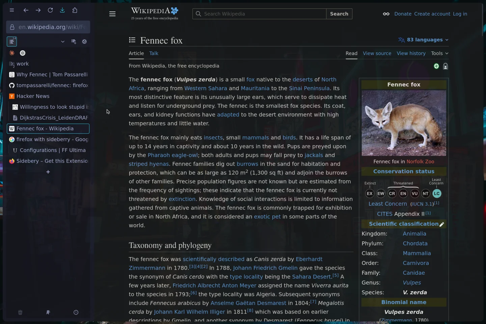
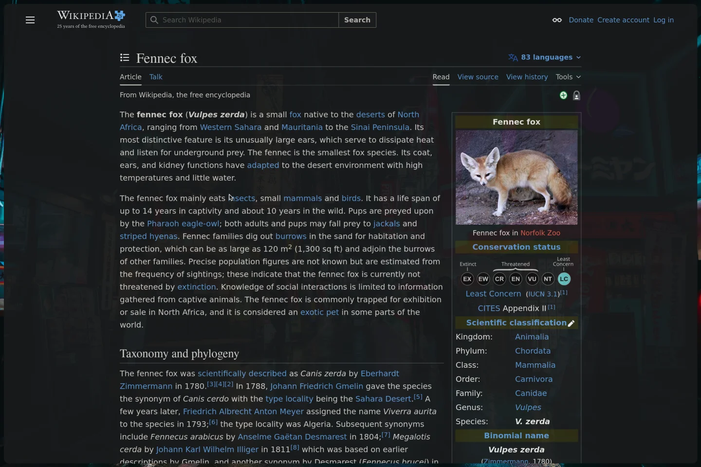

# 🦊 Fennec

> A minimal, sidebar-first Firefox UI built with `userChrome.css` — Zen Browser workflow, zero forks.

Fennec transforms Firefox into a keyboard-driven, vertical-tab browser using only CSS. No build steps, no forks — just modular CSS files and your existing Firefox.

|              Sidebar Open               |               Zen Mode (Sidebar Hidden)               |
| :-------------------------------------: | :---------------------------------------------------: |
|  |  |

---

## ✨ Features

| Feature                      | Description                                                                                   |
| ---------------------------- | --------------------------------------------------------------------------------------------- |
| 🔗 **Sideberry Integration** | URL bar lives inside the sidebar container, auto-resizes with sidebar width, expands on focus |
| 🧘 **Zen Mode**              | Toggle sidebar to hide entire UI chrome — maximizes focus when tiled or fullscreen            |
| ⌨️ **Keyboard-First UX**     | Minimal visible controls designed for Vimium/Vimium-FF workflows                              |
| 🎨 **Theme Aware**           | Respects Firefox Color themes + system light/dark mode via CSS variables                      |
| 🧩 **Modular Architecture**  | Clean separation of core theme, optional modules, and user customizations                     |
| 🔄 **Update-Safe**           | Your personal styles persist across theme updates                                             |
| 🐧 **Nix/Home Manager**      | Declarative installation supported for NixOS users                                            |

---

## 🚀 Quick Start

### Prerequisites

- Firefox 128+ (for `:has()` selector support)
- [Sideberry](https://addons.mozilla.org/en-US/firefox/addon/sidebery/) extension installed

### One-Line Install

**Linux / macOS**

```bash
curl -fsSL https://raw.githubusercontent.com/tompassarelli/fennec/main/install.sh | bash
```

**Windows (PowerShell)**

```powershell
irm https://raw.githubusercontent.com/tompassarelli/fennec/main/install.ps1 | iex
```

> 💡 **What the script does:**
>
> 1. Backs up existing `chrome/` folder → `chrome.bak.<timestamp>`
> 2. Copies Fennec's CSS modules into your Firefox profile
> 3. Writes required prefs to `user.js`
> 4. **Preserves** your `userOverrides.css` (won't overwrite on update)
>
> **To uninstall:** Delete the `chrome/` folder and remove Fennec entries from `user.js`.

---

## 🛠️ Manual Installation

### 1. Enable Custom Stylesheets

Go to `about:config` and set:

```ini
toolkit.legacyUserProfileCustomizations.stylesheets = true
```

### 2. Disable Conflicting UI Features

Either in `about:config`:

```ini
sidebar.verticalTabs = false
sidebar.revamp = false
```

_Or via Firefox Settings → uncheck "Show Sidebar" and enable "Horizontal tabs"._

### 3. Copy CSS Files

**File Structure:**

```
chrome/
├── userChrome.css       # Entry point (configure here)
├── fennec.css           # Core theme (do not edit)
├── autohide.css         # Optional module
└── userOverrides.css   # Your personal customizations
```

1. Open your profile folder: go to `about:support` → **Open Profile Folder**
   > 🐧 **Flatpak users:** Profile is at `~/.var/app/org.mozilla.firefox/.mozilla/firefox/<profile>/`
2. Create a `chrome/` directory inside it (if missing)
3. Copy all files from the repo's `chrome/` folder

### 4. Configure Features

Open `userChrome.css` and uncomment modules you want:

```css
/* Required - always enabled */
@import url("fennec.css");

/* Optional - uncomment to enable */
/* @import url("autohide.css"); */

/* Your customizations - safe to edit */
@import url("userOverrides.css");
```

### 5. Restart Firefox

> ⚠️ **Sidebar invisible after restart?**
> Press `Ctrl+H` to toggle the history panel, then activate Sideberry from the extensions menu.

---

## 📁 File Structure

| File                | Purpose                     | Edit?  | Overwritten on Update? |
| ------------------- | --------------------------- | ------ | ---------------------- |
| `userChrome.css`    | Entry point, module imports | ✅ Yes | ❌ No                  |
| `fennec.css`        | Core theme styles           | ❌ No  | ✅ Yes                 |
| `autohide.css`      | Optional autohide module    | ❌ No  | ✅ Yes                 |
| `userOverrides.css` | Personal customizations     | ✅ Yes | ❌ No                  |

**Best Practice:** Put all your custom CSS in `userOverrides.css`. This file is never overwritten during updates.

---

## 🧩 Optional Features

### Autohide Sidebar _(off by default)_

Auto-collapses the UI when the mouse leaves; reappears on hover at the left edge.

**Enable:**

1. Ensure `autohide.css` is in your `chrome/` folder
2. Uncomment this line in `userChrome.css`:
   ```css
   @import url("autohide.css");
   ```
3. Restart Firefox

> ⚠️ **Note:** Autohide conflicts with the default dynamic sidebar toggle. If you experience issues, comment out sidebar toggle rules in `userOverrides.css`.

### Recommended Extensions

| Extension                                                                        | Purpose                                                |
| -------------------------------------------------------------------------------- | ------------------------------------------------------ |
| [Vimium-FF](https://addons.mozilla.org/en-US/firefox/addon/vimium-ff/)           | Keyboard navigation that complements the minimal UI    |
| [Tree Style Tab](https://addons.mozilla.org/en-US/firefox/addon/tree-style-tab/) | Alternative to Sideberry if you prefer native tab tree |

---

## 🎨 Customization

### Change Colors, Spacing, or Sizes

Edit `userOverrides.css` to override default variables:

```css
:root {
  --fen-gap-x: 15px; /* Default: 10px */
  --fen-gap-y: 8px; /* Default: 6px */
  --fen-max-width: 700px; /* Default: 600px */
  --fen-header-height: 50px; /* Default: calculated */
}
```

### Hide Specific Elements

```css
/* Example: Hide extensions button */
#unified-extensions-button {
  display: none !important;
}

/* Example: Change URL bar border radius */
#urlbar-background {
  border-radius: 8px !important;
}

/* Example: Different sidebar background */
#sidebar-box {
  background-color: #2b2b2b !important;
}
```

> 💡 **Tip:** `userOverrides.css` loads **after** `fennec.css`, so your rules take priority.

---

## 🐧 Nix / Home Manager Installation

Declarative setup for NixOS users:

1. Add to your `flake.inputs`:

   ```nix
   inputs.fennec.url = "github:tompassarelli/fennec";
   ```

2. Import the module in Home Manager config:

   ```nix
   imports = [ inputs.fennec.homeManagerModules.default ];
   ```

3. Enable in your configuration:

   ```nix
   programs.fennec = {
     enable = true;
     profile = "your-profile-name";  # optional, default: "default-release"
     autohide = false;               # optional
     sideberry = true;               # installs via NUR
   };
   ```

4. Apply: `home-manager switch` or `nixos-rebuild switch`

> 📦 Sideberry installs automatically via [NUR](https://github.com/nix-community/NUR). Set `sideberry = false` if you manage extensions manually.

---

## 🔄 Updating Fennec

When a new version is released:

### Automatic (via install script)

```bash
curl -fsSL https://raw.githubusercontent.com/tompassarelli/fennec/main/install.sh | bash
```

### Manual

1. Download new `fennec.css` and `autohide.css` from the repo
2. Replace the old files in your `chrome/` folder
3. **Do NOT replace:** `userChrome.css` or `userOverrides.css`
4. Restart Firefox

> ✅ Your personal customizations in `userOverrides.css` are preserved!

---

## 🔒 Security Considerations

> ⚠️ **Read before installing**

- **Extensions**: Third-party Firefox extensions can introduce vulnerabilities. Only install from trusted sources (e.g., official Mozilla Add-ons).
- **Zen Mode**: Hiding the UI suppresses browser security indicators (padlock, HTTPS warnings). Fennec adds a custom "Not Secure" header alert for HTTP pages, but this is **not** a substitute for browser security UI.
- **Best Practice**: Only toggle Zen Mode after verifying a site is trustworthy.
- **No Warranty**: This project is provided "as is". The author is not liable for security issues, data loss, or damages arising from its use.

**By using Fennec, you acknowledge these risks and accept responsibility for your browsing security.**

---

## 🛟 Troubleshooting

| Issue                  | Solution                                                                              |
| ---------------------- | ------------------------------------------------------------------------------------- |
| Sidebar not visible    | Press `Ctrl+H`, then activate Sideberry from extensions menu                          |
| CSS not applying       | Verify `toolkit.legacyUserProfileCustomizations.stylesheets = true` in `about:config` |
| URL bar misaligned     | Ensure `sidebar.revamp = false`                                                       |
| Theme colors broken    | Check that `:root[lwtheme]` variables are not overridden elsewhere                    |
| Autohide not working   | Ensure `autohide.css` is imported in `userChrome.css`                                 |
| Conflicts after update | Check `userOverrides.css` for outdated selectors                                      |

Still stuck? → [Open an issue](https://github.com/tompassarelli/fennec/issues)

---

## 🧑‍💻 For Developers / Contributors

### Repository Structure

```
fennec/
├── chrome/
│   ├── userChrome.css       # Entry point (imports)
│   ├── fennec.css           # Core theme
│   ├── autohide.css         # Optional module
│   └── userOverrides.css    # User template
├── install.sh               # POSIX-compatible installer
├── install.ps1              # Windows PowerShell installer
├── home-manager/            # Nix module
├── img/                     # Screenshots
├── README.md                # This file
└── css_archive.md           # Archived/experimental code
```

### Code Style

- CSS organized in `#region` blocks (foldable in VS Code / Vim `za`)
- Variables prefixed with `--fen-` for easy identification
- `!important` used sparingly, only where Firefox native styles override
- Each module file has version header and update warnings

### Development Workflow

1. Fork the repo
2. Test changes in a dedicated Firefox profile
3. Document new CSS variables or behaviors in `:root`
4. Update version numbers in affected files
5. Open a PR with a clear description

### Building a Module

If you want to create an optional module (like `autohide.css`):

1. Create `yourModule.css` in `chrome/`
2. Add version header with conflict warnings
3. Document in `userChrome.css` as optional import
4. Update README with feature description

---

## 📄 License

MIT — Use, modify, and distribute freely. Attribution appreciated.

[](LICENSE)

## 🙏 Acknowledgments

- [Sideberry](https://github.com/mbnuqw/sidebery) — Vertical tabs extension that makes Fennec possible
- [Zen Browser](https://zen-browser.app/) — Inspiration for the sidebar-first workflow
- [Lepton](https://github.com/black7375/Firefox-UI-Fix) — CSS architecture inspiration
- Firefox community — For keeping `userChrome.css` alive

---

**Made with ❤️ by [Tom Passarelli](https://github.com/tompassarelli)**
