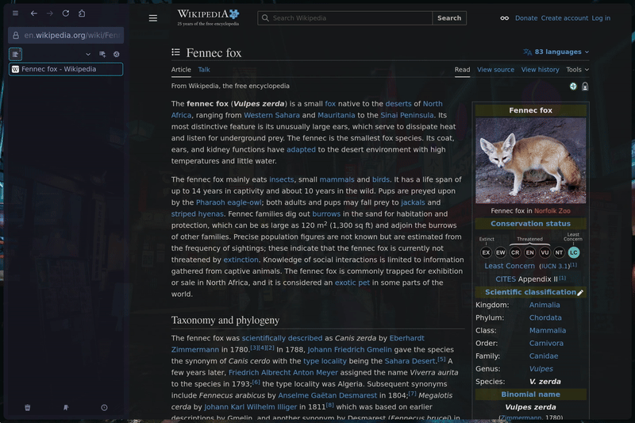

Fennec
A customized Mozilla Firefox experience designed around minimalism and optimized vertical tab support. Achieved through userChrome.css modifications and cohesive extension integrations.

| Sidebar Open | Zen Mode |
|:---:|:---:|
|  |  |

## Features

🔗 **Enhanced Sideberry Integration** - Urlbar inside the sidebar-box, tracks sidebar width, and expands when focused

🧘 **Zen Mode** - Toggling the sidebar hides the UI, maximizing screen space and aiding focus when tiled or maximized

✨ **Minimal Chrome** - Only essential objects exposed, coherent with a keyboard driven UX

🛠️ **Community Minded** - Clean code and detailed docs to support customization and contribution

🎨 **Theme Support** - System themes (light-dark) supported. User created Firefox themes are also supported.

## Installation

> Please see [security considerations](#security-considerations) before installing

### 1. Install the Sideberry Extension

Install [Sideberry](https://addons.mozilla.org/en-US/firefox/addon/sidebery/) from Firefox Add-ons.

### 2. Configure Firefox Settings

1. Open Firefox Settings (`about:preferences`)
2. Search for **"horizontal tabs"** and set **Horizontal Tabs** to **enabled**
3. Search for **"show sidebar"** and set **Show Sidebar** to **off**
   - With this off, you'll use keyboard shortcuts to toggle Sideberry, history, bookmarks, etc.
4. Ensure the sidebar is configured to appear on the **left side** (this is the default)

### 3. Install userChrome.css

**Enable custom stylesheets in Firefox:**
1. Go to `about:config` in the address bar
2. Search for `toolkit.legacyUserProfileCustomizations.stylesheets` and set it to `true`

**Locate your Firefox profile directory:**
1. Go to `about:support` in the address bar
2. Under "Application Basics", click **Open Profile Folder**
   - Flatpak users: the profile directory is at `~/.var/app/org.mozilla.firefox/.mozilla/firefox/<profile>`

**Copy the CSS files:**
1. Inside the profile folder, create a `chrome` directory if it doesn't already exist
2. Copy `userChrome.css` from this repo's `chrome/` folder into that `chrome` directory
3. Copy `autohide.css` into the same `chrome` directory (needed if you want [autohide](#autohide-off-by-default))

### 4. Apply Sideberry Styles

> Optional, but needed to center the Sideberry drawer.

1. Right-click the Sideberry icon and select **Settings** (or click the gear icon in the extension menu)
2. In the left sidebar, scroll to the bottom and select **Styles Editor**
3. Paste the contents of `sideberry.css` from this repo into the editor

### 5. Restart Firefox

### Optional Recommended Extensions
- **[Vimium](https://addons.mozilla.org/en-US/firefox/addon/vimium-ff/)** - Keyboard-driven navigation that complements the minimal, distraction-free interface

## Optional Features

### Autohide (off by default)

Sidebar must be enabled (not toggled off). When enabled, the drawer auto-collapses when the mouse leaves and reappears when hovering the left edge of the window.

To enable:
1. Ensure `autohide.css` is in the same `chrome` directory as `userChrome.css` (see [installation step 3](#3-install-userchromecss))
2. Uncomment `@import url("autohide.css");` in `userChrome.css`
3. Restart Firefox

## Usage Guide

Sideberry is used for tabs, toggling the extension shortcut set to sideberry toggles the whole UI.
This also applies to: history, bookmarks, etc. shortcuts

💬 **[Discussions](https://github.com/tompassarelli/fennec-ui/discussions)** - ask questions, share setups, and connect with other users

📝 **[Releases](https://github.com/tompassarelli/fennec/releases)** - version history and changelog

🛤️ **[Roadmap](https://github.com/tompassarelli/fennec-ui/wiki/Roadmap)** - planned features and development timeline

👾 **[Known Issues & Troubleshooting](https://github.com/tompassarelli/fennec-ui/wiki/Troubleshooting)** - noted some common issues and workarounds 

## Security Considerations

- The install guide directs users to download Firefox extensions. Firefox extensions can introduce security vulnerabilities and/or take direct hostile actions against users. 
- Zen Mode hides the UI which obviously suppresses security signals like padlock warnings. In appreciation of this concern, Fennec will still attempt to surface a custom HTTP Not Secure security warning prepended to page content as a header alert. Not a solution against phishing and other attacks/vulnerabilities, only toggle the UI after the page has been verified as secure and trustworthy.
- **Use at your own risk** - The author is not liable for any security issues, data breaches, or other damages of usage of this repository or mentioned extensions.
- **You are responsible** for verifying the security of websites, code, and extensions used
- Always keep Firefox updated

**By using this theme and mentioned Firefox extensions, you acknowledge these risks and agree that the author bears no responsibility for any consequences.**
